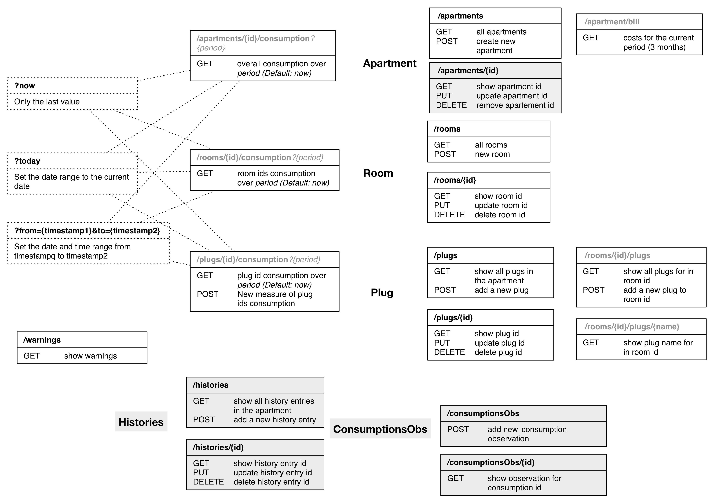
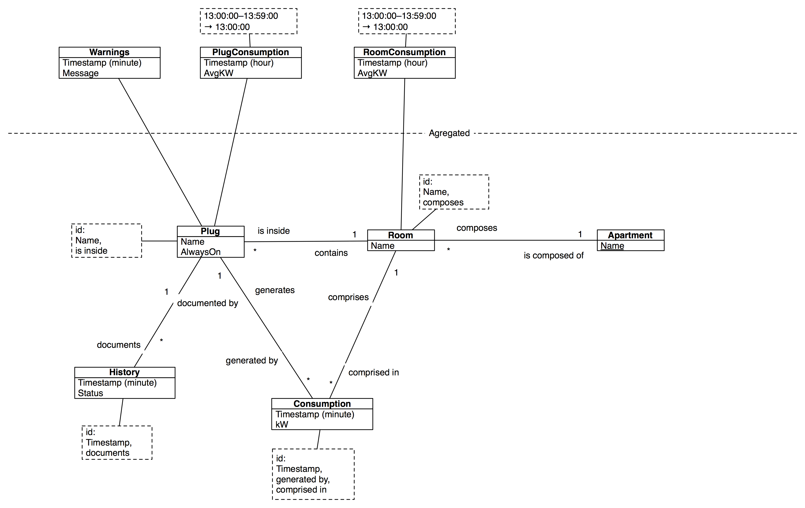

# NRJ Saver

## API

## Class diagram

## Marche à suivre
*Runner le projet NRJ
*Accéder à localhost:8080/api/test2 pour peupler la BD
*Accéder au site qui se trouve sur le localhost

* Capteurs
    * Température
    * Chauffage
    * Etat (veille/on/off)
    * Ouverture
    * Présence
* Alertes
* Stats
    * Consommation
    * Coûts
* Données en temps réel
    * Consommation live → culcul des coûts/température

